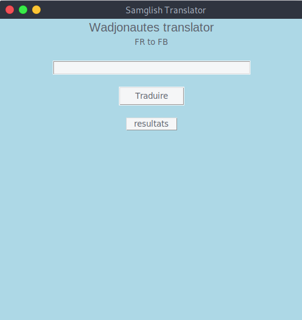

# traduction par dictionnaire en python
Nous allons utiliser un dictionnaire pour traduire des phrases en bon français en langage sms.

sms_dictionnary = {' ': ' ', 'bonjour': 'bjr', 'salut': 'slt'}

```python
phrase = input("Entrez une phrase :")

sms_dictionnary = {' ': ' ', 'bonjour': 'bjr', 'salut': 'slt'}  # completer le dictionnaire
 
 
def sms_translator():
 
    sms_message = ""
    for x in phrase:
        try: # on éssait de traduire
            sms_message += sms_dictionnary[x]
            sms_message += " "
        except KeyError:# sinon on restitue le mot tel qu'il est.
            sms_message += phrase[phrase.index(x)]
            sms_message += " "
    print(sms_message)
 
 
phrase += ""
 
phrase = [mot for mot in phrase.split(" ")]
 
 
sms_translator()
```

## Fenetre 
nom du programme `Application.py`

```python
import re
from tkinter import *
import tkinter as tk
gui = tk.Tk()
gui.geometry("500x500")
gui.title("Samglish Translator")
gui.configure(background="lightblue")
def Translate(phrase:StringVar):
    motsFR = ["bonjour", "salut"]
    motsFB = ["bjr", "slt"]
    for i in range(len(motsFR)):
        phrase = re.sub(motsFR[i], motsFB[i], phrase)
    print(phrase)

myLabel=tk.Label(gui, text="Wadjonautes translator", font=("Arial", 15),background="lightblue")
myLabel.pack()
myLabel1=tk.Label(gui, text="FR to FB",background="lightblue")
myLabel1.pack()
myEntry = tk.Entry(gui, width=40)
myEntry.pack(pady=20)

reponse=tk.StringVar()
reponse="resultats"

btn = tk.Button(gui, height=1, width=10, text="Traduire", command=Translate(reponse))
btn.pack()
Affiche=tk.Label(gui, text=reponse,relief=RAISED, width=10)
Affiche.pack(pady=20)

gui.mainloop()
```
